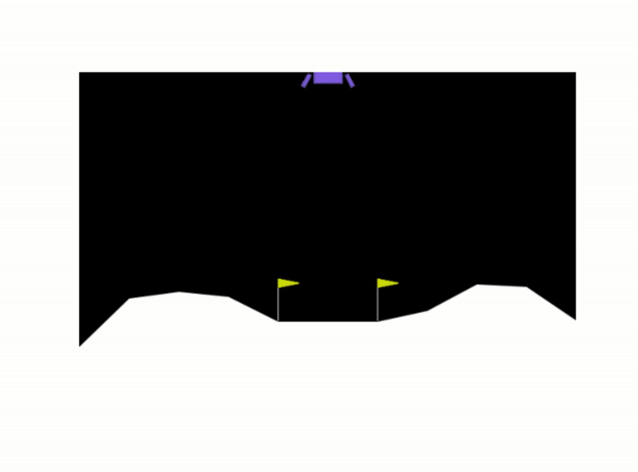

# ReinforcementLearning_OpenGym
# 🚀 Reinforcement Learning Gym Environment Solver  

A **deep reinforcement learning (RL) framework** built with **PyTorch** to solve **OpenAI Gym environments** such as **LunarLander-v2** and **CartPole-v1**.  
This repository implements **various RL algorithms from scratch**, including:  

✅ **Deep Q-Learning (DQN)**  
✅ **Double DQN**  
✅ **Soft Actor-Critic (SAC)**  
✅ **Actor-Critic (A2C)**  
✅ **Policy Gradient (REINFORCE)**  

This project serves as a **foundation for future RL applications** in more complex environments!  

---

## 📌 Features  

- 🏋 **Train RL agents** to solve OpenAI Gym environments.  
- 🧠 **Custom-built RL models** implemented using PyTorch.  
- 🎯 **Multiple algorithms available**, including **DQN, SAC, Actor-Critic, and Policy Gradient**.  
- 🔍 **Fine-tune hyperparameters** for better performance.  
- 📊 **Visualize training progress** with plots of episode rewards.  
- 🎮 **Easily switch environments** (LunarLander, CartPole, etc.).  

---

## 📽 Example RL Training Output  

```python
from algorithm import SACAgent

# Create SAC Agent
agent = SACAgent(state_size=space_dim, action_size=action_dim)

# Train the agent
agent.train_Agent()
```



## 🎮 Supported OpenAI Gym Environments
You can easily switch environments in train.py:

- 🛰 LunarLander-v2
- 🎢 CartPole-v1
- 🚖 MountainCar-v0 (Coming Soon!)

## ⚙️ Hyperparameters
Modify the hyperparameters in train.py to fine-tune performance:
```
# Hyperparameters:
learning_rate = 0.0001
gamma = 0.99
num_episodes = 1500
TAU = 0.01
batch_size = 100
MEMORY_SIZE = int(1e5)
```

